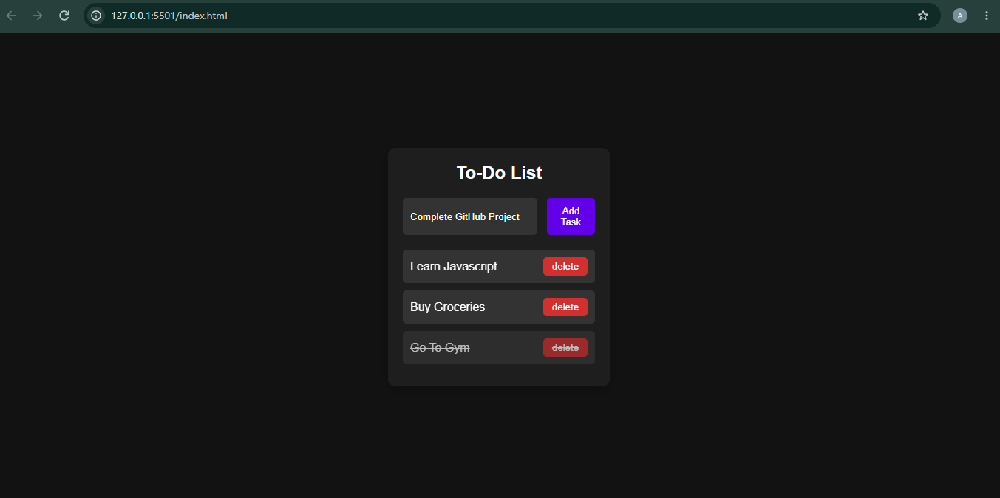

# Dark To-Do List

A simple to-do list application built using HTML, CSS, and JavaScript. It allows users to add, complete, and delete tasks while saving the tasks in the browser using localStorage.

## Features

- Add new tasks
- Mark tasks as completed
- Delete tasks
- Tasks remain saved after refreshing the page
- Dark-themed interface

## Technologies Used

- HTML
- CSS
- JavaScript
- Local Storage

## Screenshot



## Live Demo

[View Live Demo](https://anushka-kamble04.github.io/dark-to-do-list/)

## How to Run

1. Clone the repository:

   ```bash
   git clone https://github.com/Anushka-Kamble04/dark-to-do-list.git
   ```
2. Open the project folder.
3. Open `index.html` in your browser.
